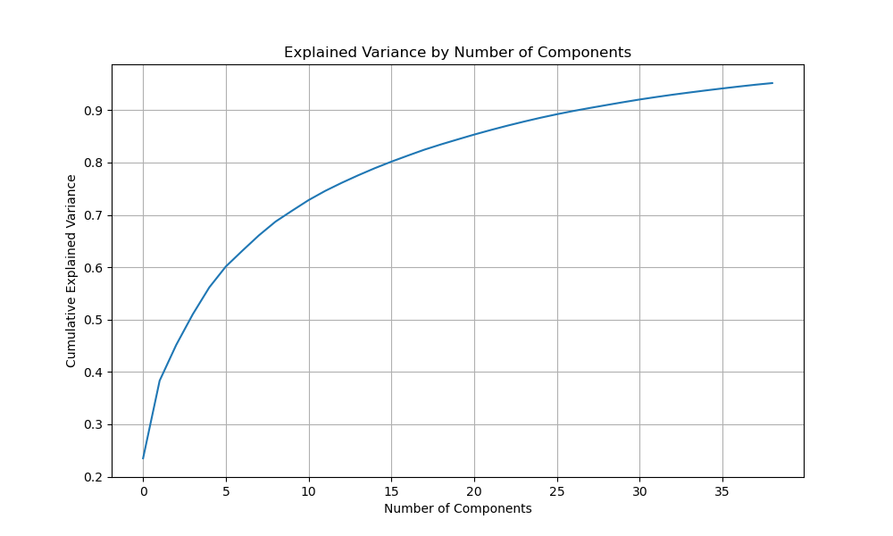

# Stock Price Factor Analysis

## 1. Introduction

This project details the process and findings of analyzing factors impacting stock prices using earnings call sentiments and other factors. I outline a comprehensive list of potential features, categorized by type, drawing from both the literature and standard practices in financial prediction. These include
1. **Earnings Call Sentiment Features**: Extracted from transcripts using NLP and sentiment analysis from the dataset `https://huggingface.co/datasets/jlh-ibm/earnings_call`
2. **Technical Indicators**: Widely used in quantitative finance and machine learning for stock prediction from datasets incl Yahoo finance, https://fred.stlouisfed.org/docs/api/fred/
They aslo include Price & Volume Features, Quarterly or annual financials, Social Media & News Sentiment, Market & Macro Features, Calendar & Event Features

## 2. Data Acquisition and Preprocessing

Built two primary datasets were used from 
1.  `data/appended_with_sentiment_features.csv`: Contains sentiment-related features derived from earnings call transcripts.
> Source: https://huggingface.co/datasets/jlh-ibm/earnings_call

2. `data/full_stock_features.csv`: Contains various technical indicators and stock-related features.
> Source: Yahoo finance and https://fred.stlouisfed.org/docs/api/fred/

The datasets were then merged based on `company` (ticker) and `date` to create a unified dataset for analysis. The resulting combined dataset has a shape of (150, 159), indicating 150 entries and 159 features.

## 3. Principal Component Analysis (PCA)

PCA was applied to the numerical features of the combined dataset to reduce dimensionality while retaining most of the variance. Non-numerical columns such as `company`, `date`, and `transcript` were excluded from PCA. Missing values in the numerical features were imputed using the mean of their respective columns. The data was then standardized before applying PCA.

**PCA Results:**
- Number of components to retain 95% variance: 39
- Cumulative explained variance: 0.9517

This indicates that 39 principal components are sufficient to capture approximately 95% of the variance in the original 150+ features, significantly reducing the complexity of the dataset while preserving most of the information.

### Explained Variance Plot

An explained variance plot (`explained_variance.png`) was generated to visualize the cumulative explained variance by the number of components.

.

## 4. Decision Tree and Random Forest Models

Decision Tree and Random Forest Regressors were trained using the PCA-transformed features to predict the `close` stock price. The dataset was split into training (80%) and testing (20%) sets.

**Model Performance:**

### Decision Tree Regressor
- RMSE: 349.37
- R2 Score: 0.63

### Random Forest Regressor
- RMSE: 354.23
- R2 Score: 0.62

Both models show similar performance, with R2 scores around 0.62-0.63, indicating that approximately 62-63% of the variance in the stock closing price can be explained by the PCA features. The RMSE values suggest the average magnitude of the errors in predicting the closing price.

## 5. Feature Importance and Timing Factors

To understand which factors impact stock prices, the feature importances from the Random Forest model were analyzed. Since the model was trained on PCA components, the importances reflect the contribution of these abstract components.

**Top Feature Importances from Random Forest (PCA Components):**

| Feature                | Importance |
|------------------------|------------|
| principal_component_8  | 0.301159   |
| principal_component_6  | 0.193900   |
| principal_component_10 | 0.091175   |
| principal_component_1  | 0.050482   |
| principal_component_4  | 0.049095   |

These are the top 5 most important principal components in predicting stock prices.

To gain insight into the original features contributing to these principal components, the loadings of the original features on the first few principal components were examined:

### Top Contributing Original Features to Principal Components:

**Principal Component 1 (Explained Variance: 0.24):**
- Low: 0.167434
- Close: 0.167422
- High: 0.167369
- Open: 0.167295
- trend_ichimoku_conv: 0.166910
- volatility_kcl: 0.166709
- momentum_kama: 0.166664
- volatility_kcc: 0.166646
- trend_ema_fast: 0.166627
- volume_vwap: 0.166580

This component primarily captures general stock price movements and some technical indicators related to trends and volatility.

**Principal Component 2 (Explained Variance: 0.15):**
- momentum_rsi: 0.191323
- volatility_bbp: 0.188841
- volatility_dcp: 0.187256
- trend_cci: 0.186238
- trend_vortex_ind_diff: 0.185639
- trend_vortex_ind_pos: 0.185406
- momentum_stoch_signal: 0.182459
- momentum_stoch: 0.181600
- momentum_wr: 0.181600
- trend_adx_neg: 0.171163

This component is heavily influenced by various momentum and volatility indicators.

### Timing Factors

The current analysis focuses on predicting stock prices based on features available at a given date. 

##### Time Period Definition and Data Splitting

The combined dataset was split into two distinct periods based on the available data:

- **Pre-COVID:** Up to December 31, 2019
- **COVID:** January 1, 2020, to September 17, 2020 (end of available data)

### Pre-COVID Period PCA Results:
- Number of components to retain 95% variance: 37
- Cumulative explained variance: 0.9521
  
**Top Contributing Original Features to Principal Components:**

**Principal Component 1 (Explained Variance: 0.26):**
- Low, Close, High, Open (general stock price movements)
- trend_ichimoku_conv, momentum_kama, volatility_kcl, trend_ichimoku_a, trend_ema_fast, volatility_kcc, volume_vwap (technical indicators related to trends, momentum, and volatility)

In the pre-COVID period, a mix of general stock price movements, various technical indicators (momentum, volatility, trend), financial term frequencies, sentiment features, and some macroeconomic indicators were prominent.

### COVID Period PCA Results:
- Number of components to retain 95% variance: 14
- Cumulative explained variance: 0.9573

**Top Contributing Original Features to Principal Components:**

**Principal Component 1 (Explained Variance: 0.28):**
- trend_sma_slow, volatility_bbm, volatility_dcm, trend_psar_down, trend_ema_slow, momentum_kama, volatility_kch, trend_ichimoku_base, trend_ichimoku_a, trend_psar_up (various trend and volatility indicators)

During the COVID period, volatility measures, momentum indicators, and macroeconomic factors like CPI and unemployment appear to have played a more significant role, alongside sentiment and financial term frequencies.

## 6. Conclusion

This analysis successfully combined sentiment and stock features, reduced dimensionality using PCA, and built predictive models using Decision Trees and Random Forests. The feature importance analysis, though based on PCA components, provides insights into the types of original features that are most influential in predicting stock prices. 

The further period-wise analysis reveals shifts in the prominence of factors influencing stock prices. While technical indicators related to trends, momentum, and volatility remain consistently important across both periods, the COVID period shows a heightened influence of macroeconomic factors and specific volatility measures. Sentiment and financial term frequencies also contribute significantly in both periods.

Further analysis with a broader dataset covering the post-COVID period would provide a more complete picture of how these influencing factors evolve over time.

## 7. Hyperopt Analysis

Using Hyperopt for a RandomForestRegressor model, aimed at predicting stock prices across different historical periods: pre-COVID, COVID, and post-COVID. The models were trained on Principal Component Analysis (PCA) transformed features derived from combined stock and sentiment datasets.

**Optimization:** Hyperopt was used to find the optimal hyperparameters for the RandomForestRegressor. The search space included:
- `n_estimators`: Number of trees in the forest (50 to 200)
- `max_depth`: Maximum depth of the tree (5 to 20)
- `min_samples_split`: Minimum number of samples required to split an internal node (2 to 10)
- `min_samples_leaf`: Minimum number of samples required to be at a leaf node (1 to 5)

The objective function minimized the Root Mean Squared Error (RMSE) on a validation set (20% of the data) for each period.

### Pre-COVID Period

**Best Hyperparameters:**
- `max_depth`: 9.0
- `min_samples_leaf`: 5.0
- `min_samples_split`: 10.0
- `n_estimators`: 50.0

**Best Loss (RMSE):** 502.42

### COVID Period

**Best Hyperparameters:**
- `max_depth`: 8.0
- `min_samples_leaf`: 3.0
- `min_samples_split`: 10.0
- `n_estimators`: 170.0

**Best Loss (RMSE):** 612.04

### Post-COVID Period

**Result:** Skipped due to insufficient data.

Hyperopt successfully identified optimal hyperparameters for stock price prediction models in the pre-COVID and COVID periods. The results underscore the dynamic nature of financial markets and the need for adaptive modeling strategies. By leveraging period-specific optimizations and continuously updating models with new data, the accuracy and relevance of stock price predictions can be significantly enhanced.

